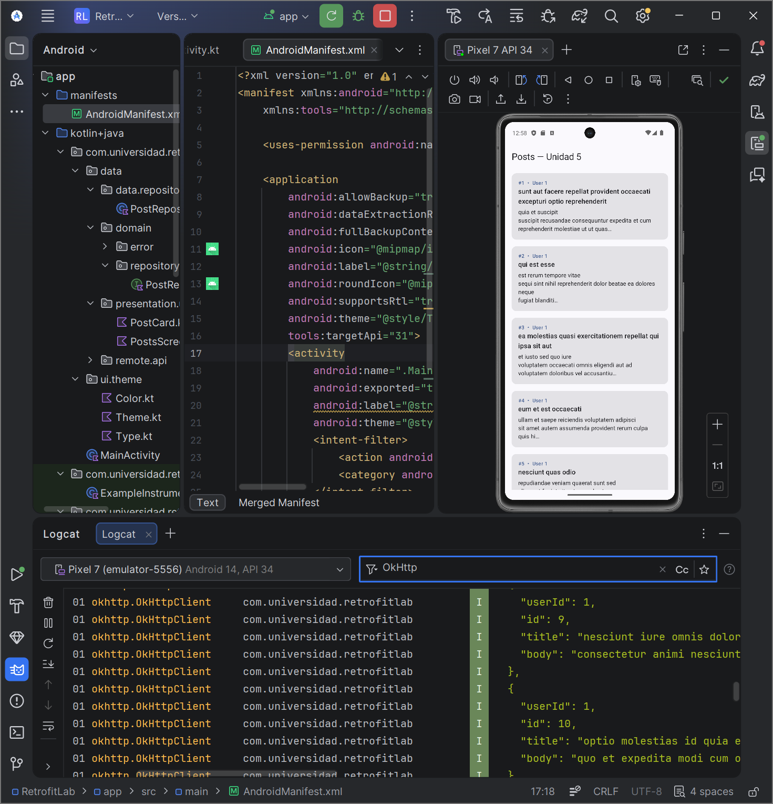
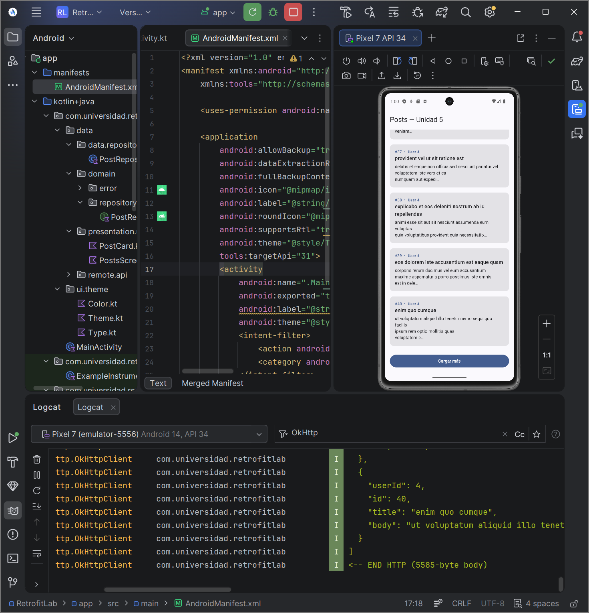
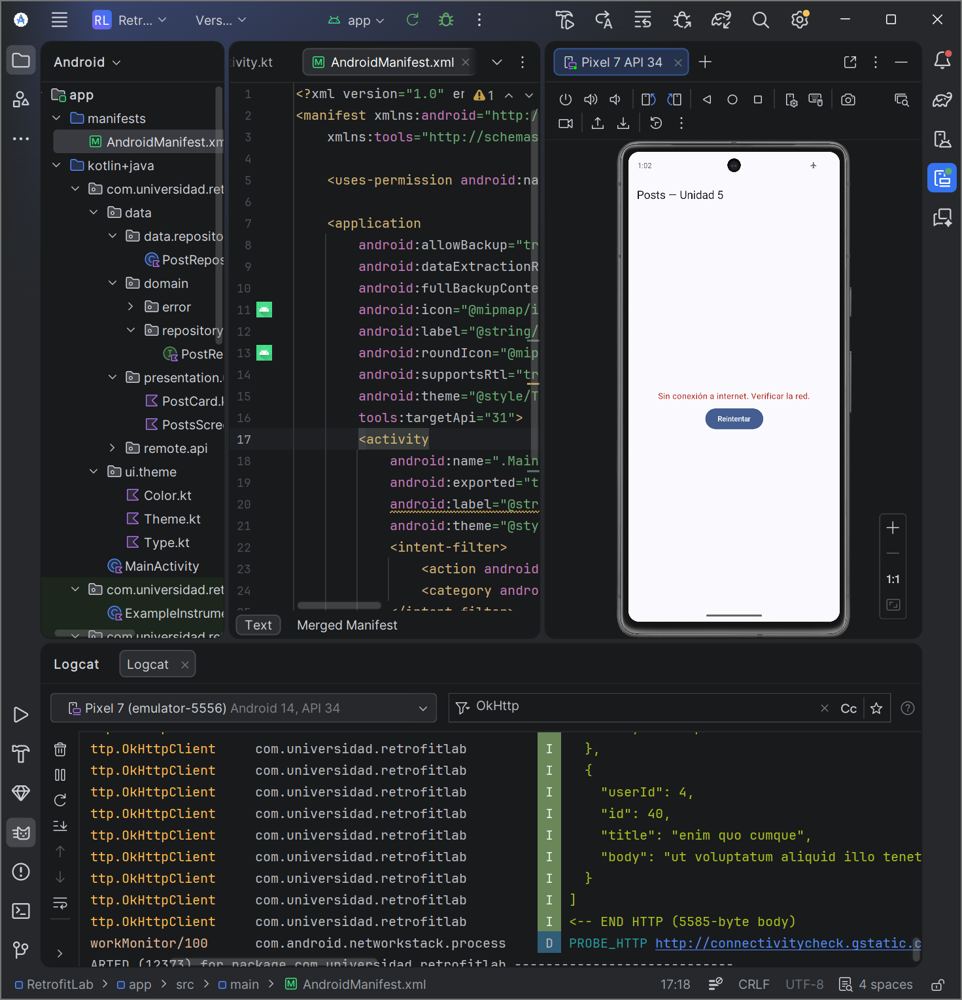

# RetrofitLab — Unidad 5: Consumo de Servicios y Comunicación con Backend

Aplicación Android que consume la API pública [JSONPlaceholder](https://jsonplaceholder.typicode.com) para mostrar una lista de posts con **paginación simulada**, **gestión de estados de UI** y **manejo tipado de errores de red** mediante `sealed class`.

Desarrollada con **Kotlin**, **Jetpack Compose**, **Retrofit + OkHttp**, **kotlinx.serialization** y **Coroutines + StateFlow**, siguiendo arquitectura en capas (MVVM: `data` / `domain` / `presentation`).

---

## Tabla de contenidos

1. [Requisitos](#requisitos)
2. [Configuración y ejecución](#configuración-y-ejecución)
3. [Arquitectura del proyecto](#arquitectura-del-proyecto)
4. [Flujo implementado](#flujo-implementado)
5. [Decisiones de diseño](#decisiones-de-diseño)
6. [Capturas de pantalla](#capturas-de-pantalla)
7. [Checkpoints verificados](#checkpoints-verificados)

---

## Requisitos

- Android Studio Hedgehog (2023.1.1) o superior
- JDK 17
- Dispositivo físico con Android 8.0+ o emulador AVD (API 26+)
- Conexión a internet (la API es pública, sin autenticación real)

---

## Configuración y ejecución

1. Clonar el repositorio:

   ```bash
   git clone https://github.com/TU_USUARIO/apellido-post1-u5.git
   cd apellido-post1-u5
   ```

2. Abrir el proyecto en Android Studio.
3. Esperar a que Gradle sincronice las dependencias.
4. Ejecutar en un emulador o dispositivo con API ≥ 26 (`Run 'app'`).

No requiere API key ni configuración adicional: la `baseUrl` apunta a `https://jsonplaceholder.typicode.com/`.

---

## Arquitectura del proyecto

```
com.universidad.retrofitlab
├── data
│   ├── remote
│   │   ├── api/PostApi.kt              ← Interfaz Retrofit
│   │   └── dto/PostDto.kt              ← DTO + mapper toDomain()
│   └── repository/PostRepositoryImpl.kt
├── domain
│   ├── error/AppError.kt               ← sealed class de errores + mappers
│   ├── model/Post.kt                   ← Modelo de dominio
│   └── repository/PostRepository.kt    ← Contrato del repositorio
├── di
│   └── NetworkModule.kt                ← OkHttp + Interceptors + Retrofit
├── presentation
│   ├── ui
│   │   ├── PostsScreen.kt              ← Pantalla Compose con estados
│   │   └── PostCard.kt                 ← Item de la lista
│   └── viewmodel
│       ├── PostsViewModel.kt           ← StateFlow + viewModelScope
│       └── PostsUiState.kt             ← sealed class Loading/Success/Error/Empty
└── MainActivity.kt
```

La separación en **data / domain / presentation** garantiza que la capa de UI nunca dependa de Retrofit, ni que el dominio conozca los DTOs. El mapeo `PostDto.toDomain()` ocurre en la frontera `data`.

---

## Flujo implementado

1. `MainActivity` monta `PostsScreen`.
2. `PostsScreen` instancia `PostsViewModel` y observa su `uiState` vía `collectAsStateWithLifecycle`.
3. En `init`, el ViewModel lanza `loadPosts()` dentro de `viewModelScope`.
4. El repositorio invoca `PostApi.getPosts(page=1, limit=20)` a través de Retrofit.
5. `OkHttpClient` añade los headers `Accept`, `X-App-Version`, `Authorization` mediante un interceptor, y el `HttpLoggingInterceptor` imprime la request/response completa en Logcat.
6. La respuesta JSON es deserializada por `kotlinx.serialization` a `List<PostDto>` y mapeada a `List<Post>`.
7. El `StateFlow` emite `Loading → Success / Empty / Error`, lo que hace recomponer la UI automáticamente.
8. Al pulsar **Cargar más**, el ViewModel incrementa `currentPage`, solicita la siguiente página y la concatena a la lista acumulada.
9. Si ocurre una excepción, el extension `Throwable.toAppError()` la mapea a una variante tipada (`Network`, `Unauthorized`, `NotFound`, `Server`, `Unknown`) y `AppError.toMessage()` entrega el texto amigable para el usuario; la pantalla `Error` muestra el botón **Reintentar**.

---

## Decisiones de diseño

### Interceptors en OkHttp

- **`HttpLoggingInterceptor` con nivel `BODY`**: permite inspeccionar en Logcat el request completo (URL, headers y body) y la respuesta JSON. Ideal para desarrollo; en release se debería bajar a `NONE` o `BASIC`.
- **Interceptor de autenticación**: aunque JSONPlaceholder no exige token, se añade `Authorization: Bearer demo-token-u5` junto con `Accept` y `X-App-Version` para simular un flujo real y cumplir el requisito del laboratorio. Modificarlo aquí es suficiente para todas las requests: ningún llamador de la API necesita manipular headers manualmente.
- **Timeouts** de 30 s en `connect` y `read` evitan cuelgues indefinidos en redes inestables.

### Mapeo de errores con `sealed class`

Usar `AppError` en el dominio aporta tres ventajas:

1. La UI solo depende de un tipo propio, no de `HttpException` ni `IOException`.
2. El compilador obliga a manejar cada variante en el `when`, evitando ramas olvidadas.
3. Los mensajes se localizan en un único punto (`toMessage()`), fácil de traducir luego a `strings.xml`.

La función `Throwable.toAppError()` discrimina por tipo: `IOException` → `Network` (no hay conexión), `HttpException` → se inspecciona `code()` para separar 401/403, 404 y 5xx, y el resto cae en `Unknown`.

### `kotlinx.serialization` con `ignoreUnknownKeys = true`

El backend podría añadir campos nuevos sin romper la app. `coerceInputValues = true` sustituye `null` por el valor por defecto cuando el campo no es nullable, otra protección contra cambios del contrato.

### Estados de UI con `sealed class PostsUiState`

Modelar `Loading`, `Empty`, `Success` y `Error` como estados mutuamente excluyentes elimina combinaciones inválidas (por ejemplo, "loading = true y error != null a la vez"). `StateFlow` garantiza un valor inicial y comparte la última emisión con los nuevos observadores.

---

## Capturas de pantalla

### Lista cargada (Success)



### Pantalla de carga (Loading)



### Error de red (Network)



---

## Checkpoints verificados

- ✅ La app compila sin errores y muestra la lista de posts al iniciarse. Logcat imprime los requests/responses del `HttpLoggingInterceptor`.
- ✅ "Cargar más" obtiene la página siguiente. La URL del Logcat muestra `_page=2&_limit=20` y los nuevos posts se anexan al final.
- ✅ Con la red deshabilitada, la pantalla presenta el mensaje `AppError.Network` y el botón **Reintentar**. Al reactivar la red, la lista carga correctamente.

---

## Autor

**[Tu Nombre Apellido]** — Ingeniería de Sistemas, Universidad de Santander, 2026.
